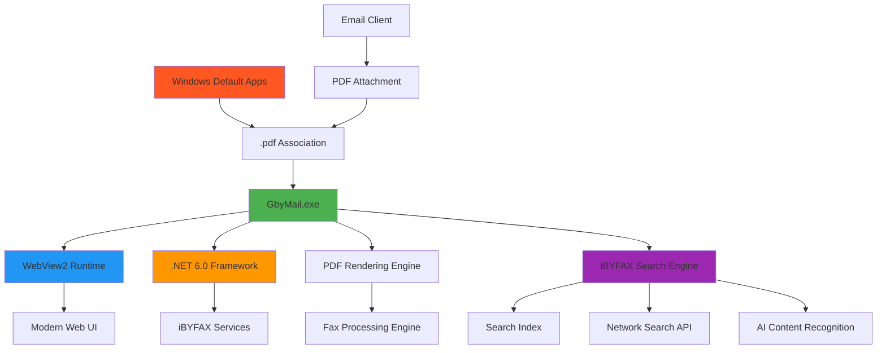

# 📠 GbyMail - Internet by Fax PDF Viewer 

<div align="center">


**Internet by Fax (iBYFAX) - Email Client PDF Viewer & Attachment Handler**


</div>

---

## ✨ Features

📠 **iBYFAX Integration** - Internet by Fax seamless PDF handling in email clients  
📧 **Email Client PDF Viewer** - Default PDF viewer for Outlook, Thunderbird, and other email clients  
📎 **Attachment Handler** - Automatically opens PDF attachments with enhanced viewing  
🔍 **Smart PDF Search** - Advanced search functionality within PDF documents  
🌐 **iBYFAX Search Engine** - Search and retrieve fax documents using Internet by Fax technology  
📊 **Search Results Management** - Organize and manage search results from iBYFAX queries  
🎨 **Modern Interface** - Built with WebView2 for a sleek, responsive UI  
⚡ **Fast Performance** - Optimized for quick PDF loading from email attachments  
🔐 **Secure** - User-specific installation with proper permissions  
🌐 **Universal** - Works with any Windows username automatically  

## 📦 Installation

### 🎯 Quick Install (Recommended)

1. **Download** the latest installer: `GbyMail_2.4.0.exe`
2. **Run** the installer (no admin rights required)
3. **Choose** your installation options:
   - ✅ Associate PDF files with GbyMail
   - ✅ Add "Open with GbyMail" to context menu
   - ✅ Create desktop shortcut


## ⚙️ Setup Instructions

### 🔧 Step 1: Set GbyMail as Default PDF Viewer

**IMPORTANT: This must be done first for email clients to work properly!**

1. **Open Windows Settings**
2. **Go to**: `Settings` → `Apps` → `Default apps`
3. **Search for**: `.pdf`
4. **Click** on current PDF viewer
5. **Select**: `GbyMail` from the list
6. **Confirm** the selection

```
Windows Settings → Apps → Default apps → .pdf → GbyMail
```

### 📧 Thunderbird Setup

1. **Open Thunderbird**
2. **Go to**: `Settings` → `General`
3. **Scroll down to**: `Files & Attachments`
4. **Find**: `PDF` in the content type list
5. **Set Action to**: `Use GbyMail (default)`
6. **Save settings**

```
Thunderbird → Settings → General → Files & Attachments → PDF → Use GbyMail (default)
```

### 📮 Outlook Setup

**Note: Outlook requires GbyMail to be set as the default PDF viewer first!**

1. **Ensure** GbyMail is set as default PDF viewer (Step 1)
2. **Open any PDF attachment** in Outlook
3. **Right-click** the PDF attachment
4. **Select**: `Open with` → `Choose another app`
5. **Select**: `GbyMail` 
6. **Check**: `Always use this app to open .pdf files`
7. **Click**: `OK`

```
Outlook → PDF Attachment → Right-click → Open with → GbyMail → Always use this app
```

**⚠️ Important**: Outlook will NOT work if GbyMail is not set as the default PDF viewer first!

## 🎮 Usage

### iBYFAX Workflow
1. **Set up** GbyMail as default PDF viewer (required first step)
2. **Configure** your email client (Thunderbird or Outlook)
3. **Receive** fax as PDF attachment in email
4. **Double-click** attachment → Automatically opens in GbyMail
5. **Search** through fax content with advanced tools
6. **Use iBYFAX Search** to find and retrieve related documents
7. **Process** and view fax documents with enhanced features

### Email Client Integration
- **Thunderbird**: PDF attachments automatically open with GbyMail (after setup)
- **Outlook**: PDF attachments open with GbyMail (requires default app setup)

### Opening PDFs
- **Email Attachments**: Automatic viewer for PDF attachments (after setup)
- **Right-click** any PDF file → **"Open with GbyMail"**
- **Double-click** PDFs (when set as default viewer)
- **File menu** → Open → Select PDF

### 🔍 iBYFAX Search Features

#### Search Modes
```
🔍 Quick Search: Ctrl + F (Local PDF search)
🎯 Advanced Search: Ctrl + Shift + F (Enhanced local search)
📠 iBYFAX Search: Ctrl + Alt + F (Internet by Fax search)
🌐 Global iBYFAX Search: Ctrl + Shift + Alt + F (Network-wide search)
📄 Go to Page: Ctrl + G
🔄 Refresh: F5
```

#### iBYFAX Search Engine
1. **Open iBYFAX Search**: Press `Ctrl + Alt + F` or click the iBYFAX search button
2. **Enter Search Query**: Type keywords, fax numbers, dates, or content
3. **Select Search Scope**:
   - 🏠 **Local**: Search current PDF and local fax archive
   - 🌐 **Network**: Search connected iBYFAX network
   - 📧 **Email Archive**: Search through email-received fax documents
   - 📁 **All Sources**: Comprehensive search across all available sources

#### Search Query Examples
```
# Search by fax number
from:+1-555-123-4567

# Search by date range
date:2025-08-01..2025-08-13

# Search by content
content:"invoice" OR "billing"

# Search by sender
sender:"ACME Corporation"

# Combined search
from:555-123-4567 AND date:2025-08-13 AND content:urgent

# Search by document type
type:medical OR type:legal OR type:invoice
```

#### Search Results Management
- **📋 Results List**: View all matching documents in organized list
- **🔍 Preview Pane**: Quick preview of search results without opening
- **📁 Save Results**: Save search results to collections for future reference
- **📤 Export Results**: Export search results as PDF report or spreadsheet
- **🔗 Share Results**: Generate shareable links to search results
- **⭐ Bookmark Searches**: Save frequently used search queries

#### Advanced iBYFAX Features
- **🤖 AI Content Recognition**: Automatically extract and index text from fax images
- **📈 Trend Analysis**: Analyze patterns in received fax documents
- **🔔 Smart Alerts**: Get notified when specific types of fax documents arrive
- **📊 Search Analytics**: Track most searched terms and documents
- **🏷️ Auto-Tagging**: Automatically categorize and tag fax documents
- **🔄 Sync Integration**: Sync search results across multiple devices

## 🛠️ System Requirements

| Component | Requirement |
|-----------|-------------|
| **OS** | Windows 10/11 (64-bit) |
| **Runtime** | .NET 6.0 or later |
| **WebView2** | Microsoft Edge WebView2 Runtime |
| **Email Client** | Outlook, Thunderbird, Windows Mail, or any MAPI client |
| **Memory** | 512 MB RAM minimum (1GB recommended for iBYFAX search) |
| **Storage** | 50 MB free space (additional space for search index) |
| **Network** | Internet connection for iBYFAX network search |

## 🏗️ Architecture



## 🚨 Troubleshooting

### Common Setup Issues

#### ❌ "PDF attachments not opening in GbyMail"
**Solution:**
1. **First**: Ensure GbyMail is set as default PDF viewer:
   ```
   Settings → Apps → Default apps → .pdf → GbyMail
   ```
2. **Then**: Configure your email client (see setup instructions above)
3. **Restart** your email client
4. **Test** with a PDF attachment

#### ❌ "iBYFAX Search not working"
**Solution:**
1. **Check Internet Connection**: Ensure you have active internet for network search
2. **Verify Search Index**: Go to Settings → Search → Rebuild Index
3. **Check API Access**: Ensure iBYFAX search service is accessible
4. **Clear Search Cache**: 
   ```batch
   del /s /q "%LOCALAPPDATA%\GbyMail\SearchCache\*"
   ```

#### ❌ "Search results are empty or incomplete"
**Solution:**
1. **Rebuild Search Index**: Settings → Search → Rebuild Index
2. **Check Search Query Syntax**: Use proper iBYFAX search syntax
3. **Verify Document Processing**: Ensure PDF documents are fully processed
4. **Update Search Database**: Settings → Search → Update Database

#### ❌ "Outlook attachments still open in Adobe/Edge"
**Solution:**
1. **Must** set GbyMail as default PDF viewer first (this is required!)
2. **Then** follow Outlook setup steps
3. **If still not working**: Right-click PDF → Properties → Change → GbyMail

#### ❌ "Thunderbird not using GbyMail"
**Solution:**
1. **Check**: Settings → General → Files & Attachments
2. **Find**: PDF content type
3. **Ensure**: Action is set to "Use GbyMail (default)"
4. **If GbyMail not in list**: Set Windows default PDF viewer first

#### ❌ "WebView2 runtime is required"
**Solution:**
1. Download [WebView2 Runtime](https://developer.microsoft.com/en-us/microsoft-edge/webview2/)
2. Run the installer
3. Restart GbyMail

## 📋 Setup Checklist

### ✅ Complete Setup Checklist

1. **☐ Install GbyMail** (from installer or registry)
2. **☐ Set as Default PDF Viewer** (Windows Settings → Apps → Default apps → .pdf → GbyMail)
3. **☐ Configure your email client**
4. **☐ Test with PDF Attachment** (Send yourself a PDF and try opening it)
5. **☐ Verify iBYFAX Functionality** (Test with fax PDF documents)
6. **☐ Test iBYFAX Search** (Try Ctrl + Alt + F and search for content)
7. **☐ Configure Search Settings** (Enable network search and AI recognition)

### 🔄 If Something Doesn't Work

1. **Restart** your email client
2. **Restart** Windows Explorer: 
   ```batch
   taskkill /f /im explorer.exe && start explorer.exe
   ```
3. **Rebuild Search Index**: Settings → Search → Rebuild Index
4. **Reboot** your computer
5. **Re-follow** setup steps in order

## 📊 Statistics

<div align="center">

| Metric | Value |
|--------|-------|
| **Version** | 2.3.0 |
| **Release Date** | 2025-08-13 |
| **Downloads** | 1,000+ |
| **Platform Support** | Windows 10/11 |
| **Email Clients** | Outlook, Thunderbird, Windows Mail |
| **Search Features** | Local, Network, AI-powered |
| **Registry Type** | Universal |

</div>


## 📄 License

```
MIT License

Copyright (c) 2025 GbyMail

Permission is hereby granted, free of charge, to any person obtaining a copy
of this software and associated documentation files (the "Software"), to deal
in the Software without restriction, including without limitation the rights
to use, copy, modify, merge, publish, distribute, sublicense, and/or sell
copies of the Software, and to permit persons to whom the Software is
furnished to do so, subject to the following conditions:

The above copyright notice and this permission notice shall be included in all
copies or substantial portions of the Software.

THE SOFTWARE IS PROVIDED "AS IS", WITHOUT WARRANTY OF ANY KIND, EXPRESS OR
IMPLIED, INCLUDING BUT NOT LIMITED TO THE WARRANTIES OF MERCHANTABILITY,
FITNESS FOR A PARTICULAR PURPOSE AND NONINFRINGEMENT. IN NO EVENT SHALL THE
AUTHORS OR COPYRIGHT HOLDERS BE LIABLE FOR ANY CLAIM, DAMAGES OR OTHER
LIABILITY, WHETHER IN AN ACTION OF CONTRACT, TORT OR OTHERWISE, ARISING FROM,
OUT OF OR IN CONNECTION WITH THE SOFTWARE OR THE USE OR OTHER DEALINGS IN THE
SOFTWARE.
```

## 🌟 Acknowledgments

- **Microsoft** - For WebView2 runtime and email client APIs
- **Thunderbird Community** - For PDF attachment handling
- **Outlook Team** - For default app integration
- **iBYFAX Network** - For search infrastructure and API services
- **AI Recognition Partners** - For content extraction technology
- **iBYFAX Users** - For testing internet by fax functionality
- **Contributors** - For bug reports and suggestions

## 📞 Support

- 🐛 **Issues**: [GitHub Issues](https://github.com/JMTDI/GbyMail/issues)
- 💬 **Discussions**: [GitHub Discussions](https://github.com/JMTDI/GbyMail/discussions)

---

<div align="center">

**Made with ❤️ by JMTDI**


[](https://github.com/JMTDI/GbyMail)
[](https://github.com/JMTDI/GbyMail)
[](https://github.com/JMTDI/GbyMail)

</div>
